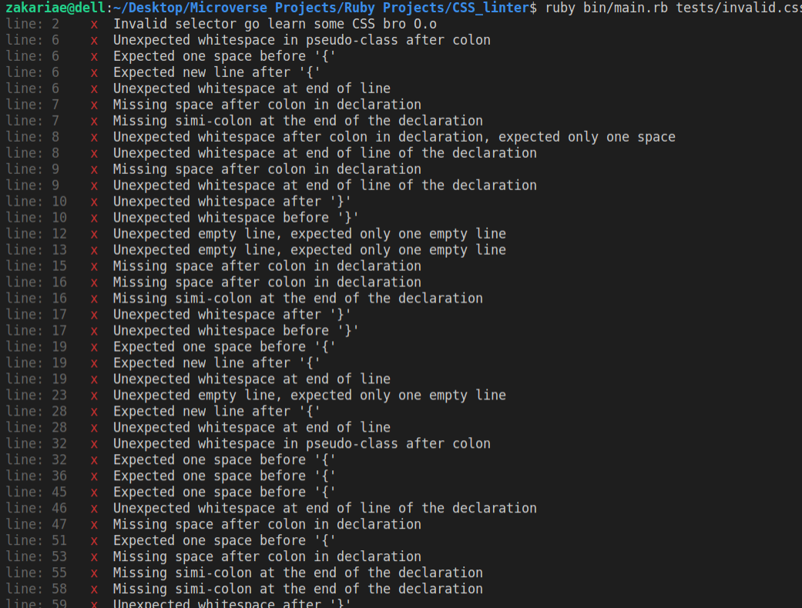
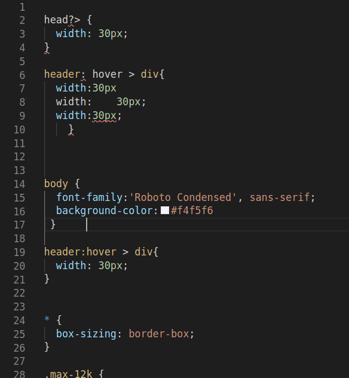
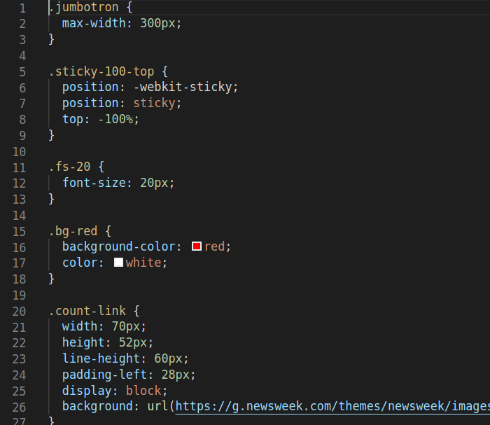
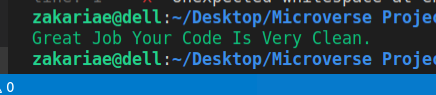

# CSS Linter

> this a ruby based linter for CSS files. it provides feedback about syntax errors in CSS files. I was inspired by Stylelint that's why you will find that the output is a bit similar and maybe the shows of colors to

## Preview



## How it works

**This version of the CSS Beginner Linter reads a css file provided in the command line like so:**

```
ruby bin/main.rb styles/style.css
```

This CSS linter will catch and display the following syntax errors in the console if there is any:

- Unknown word
- Unexpected whitespace before \'}\'
- Unexpected whitespace after \'}\'
- Invalid selector go learn some CSS bro O.o
- Unexpected whitespace before \'{\' only one space is allowed
- Unexpected whitespace at end of line
- Expected newline after \'{\'
- Expected one space before \'{\'
- Unexpected whitespace in pseudo-class after the colon
- Missing space after the colon in the declaration
- Unexpected whitespace after the colon in the declaration, expected only one space
- Missing simi-colon at the end of the declaration
- Unexpected whitespace at end of the line of the declaration
- Unexpected empty line, expected only one empty line

so as I mentioned earlier the CSS file you can put it where ever you want but with one condition which you want to target by the command line as I showed you, here is a couple of examples how the linter works:

### For an invalid css file

#### File:



#### Output:


### For a valid CSS file

#### File:



#### output:



## How To run the Linter

First of all, you need to have the linter files on your computer. You can get them either cloning this repository or downloading its contents directly

- To clone the repo, go on the project's [Github page](https://github.com/elmejdki/CSS_linter), click on "Clone or download", copy the contents of the text box, and then run `git clone "repo"` on the command line, where "repo" is the text you just copied.
- If you want to download it directly instead, go on the project's [Github page](https://github.com/elmejdki/CSS_linter), click on "Clone or download", and then on "Download ZIP". After this, you need to extract the contents of the zip file on your computer.

Once you have the files on your computer, go on the command line and navigate to the linter directory. Once there :

- create you own CSS file inside the project and fell it with whatever content but please be gentile don't write complex CSS selectors otherwise the program will fail.
- open the terminal window and then type in `bundle install` to install a ruby colorize lib that gives a good looking output.
- Run the linter directly from the root of the project directory, using the following command `ruby ./bin/main.rb .test/invalid.css` keep in mind that you can change `.test/invalid.css` to the location of the file that you have created.

## Requirements

- Ruby
- Colorize
- Rubocop

## Built with

- Ruby

## Authors

👤 **Zakariae El Mejdki**

- Github: [@elmejdki](https://github.com/elmejdki)
- Twitter: [@zakariaeelmejdki](https://twitter.com/0ca7848f87ab470)
- Linkedin: [zakariae el mejdki](https://www.linkedin.com/in/zakariae-el-mejdki-644898139/)

## 🤝 Contributing

Contributions, issues and feature requests are welcome!

Feel free to check the [issues page](issues/).

## Show your support

Give a ⭐️ if you like this project!

## Acknowledgments

​	Hat tip to anyone whose code was used

## 📝 License

This project is [MIT](lic.url) licensed.
